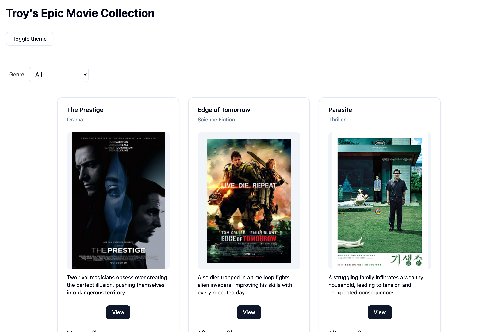
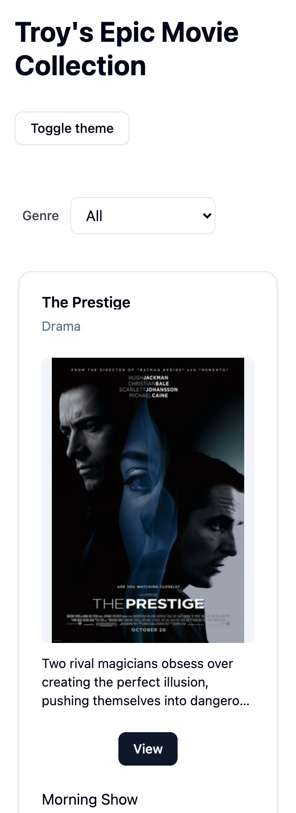
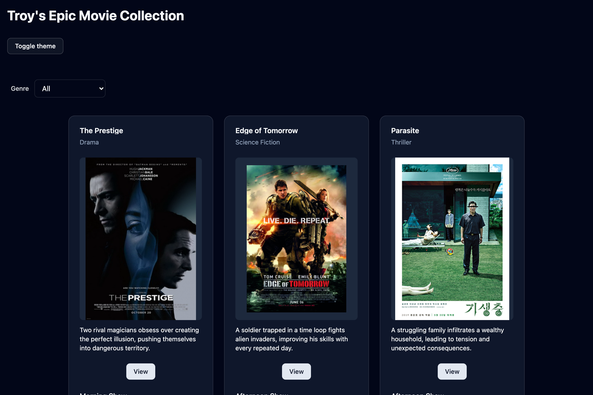
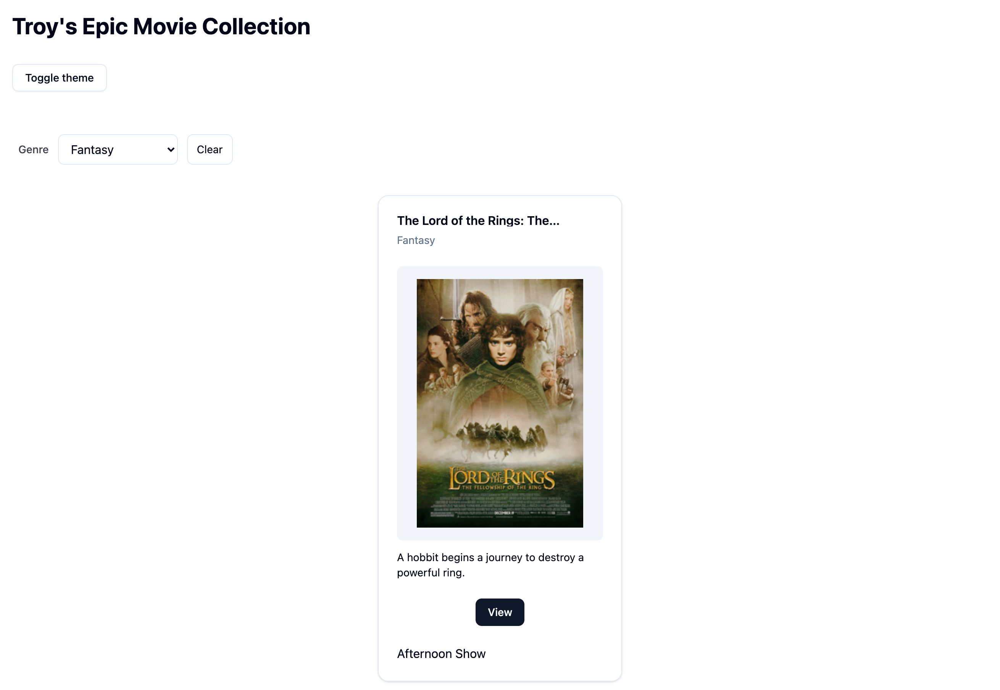
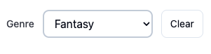
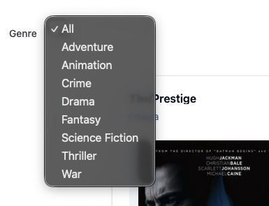

# List-rendering

I created this new repo so that my mentors can review the PR and leave comments.

## How to run this?

1. Install Bun

```bash
curl -fsSL https://bun.sh/install | bash
```

2. Run

```bash
bun install
```

3. Run

```bash
bun run dev
```

## What does it look like?

A responsive design movie list built with Typescript, React and Shadcn/ui UI library.

## Screenshots

### Responsive Design

### Large Screen



### Small Screen



### Theme Switching



### Filtering by Genre with URL query parameters



### Select Genre



